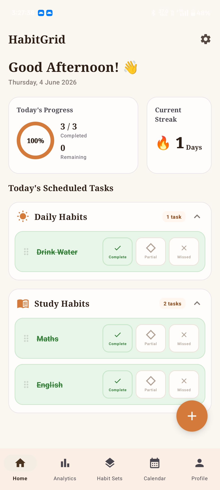
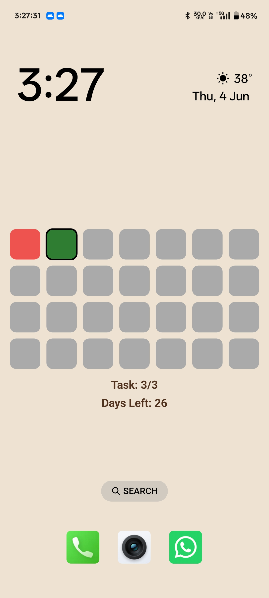
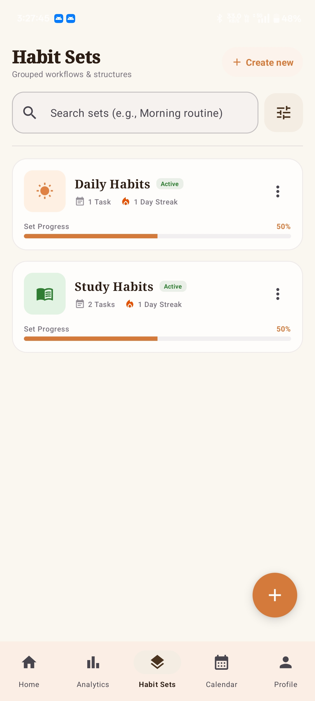
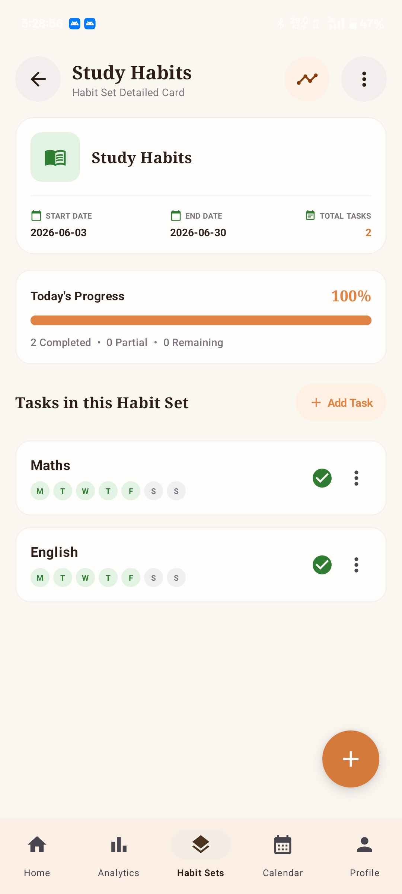
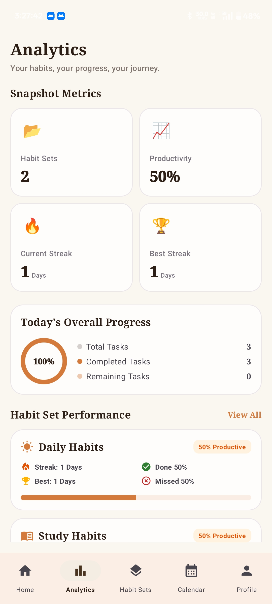
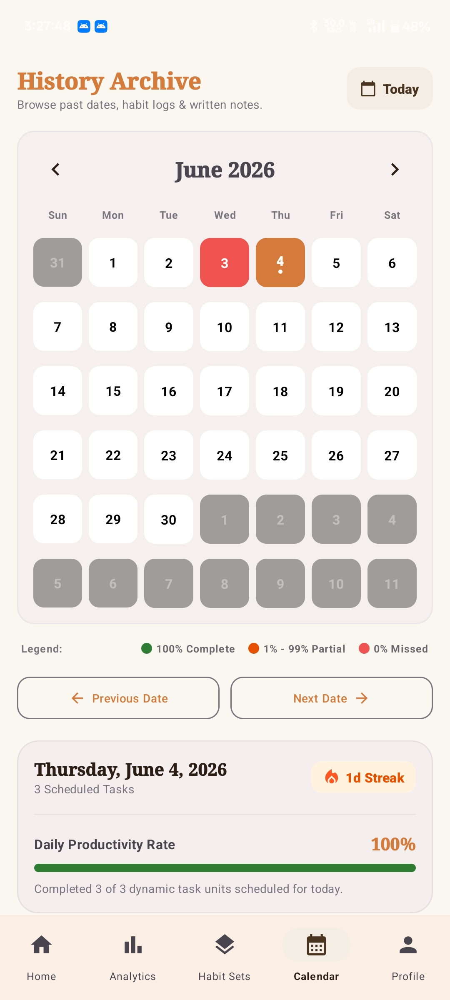
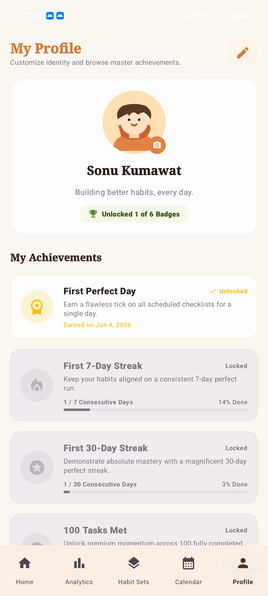
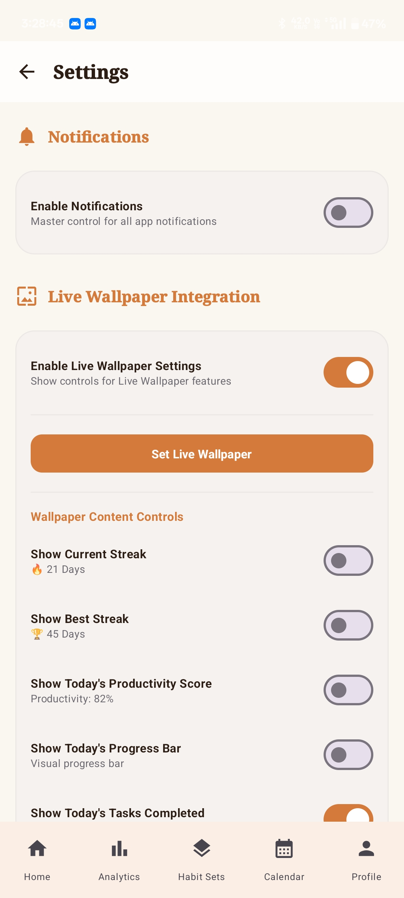
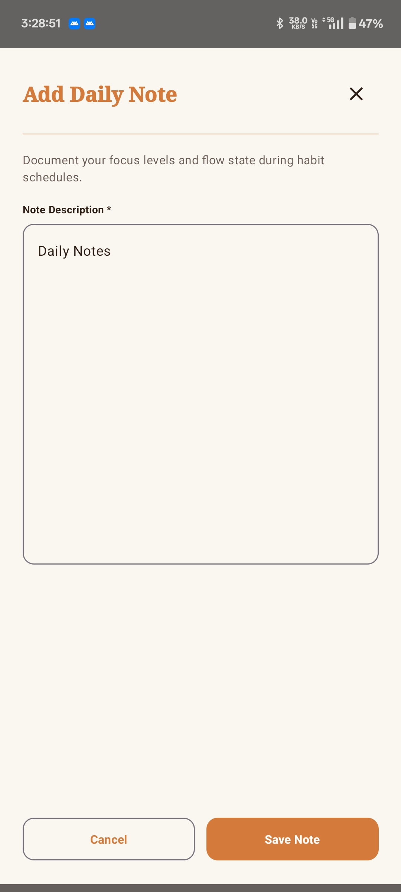

# 📊 HabitGrid

HabitGrid is a beautiful, easy-to-use Android application designed to help you build positive routines and track your daily consistency. It visualizes your habits as a clean, interactive grid—allowing you to see your progress at a single glance.

What makes HabitGrid unique is its ability to turn your actual habit grid into your phone's **Live Wallpaper**, keeping your goals front-and-center every time you unlock your device.

---

## ✨ Features Breakdown

* **🎨 Live Wallpaper Grid - **
  *Our favorite feature!* Put your habit grid directly on your phone's background screen. It updates in real-time using high-efficiency canvas drawings, giving you a gentle, ambient reminder of your daily progress.

* **🏠 Personal Dashboard - **
  Keep track of your habits for the day, check off completed tasks, and jot down quick daily notes to reflect on your journey.

* **📁 Group Your Routines - **
  Organize your habits into custom sets (like *Morning Routine*, *Work*, or *Fitness*) so you can manage related goals together.

* **📈 Easy-to-Read Progress & Analytics - **
  View simple charts, completion heatmaps, and streak counters to see how well you are staying consistent over weeks and months.

* **📅 History Calendar - **
  Look back at your calendar to review past accomplishments, see how many habits you completed on a specific day, and read your saved notes.

* **🔔 Friendly Reminders - **
  Receive notifications when it's time to log your habits, along with helpful nudges when you're about to break a streak.

* **🌗 Light & Dark Themes - **
  Automatically adjusts to your phone's light or dark mode for a comfortable reading experience day or night.

---

## 📱 App Screenshots

<table align="center">
  <tr>
    <td align="center" width="32%">
      <b>Home Dashboard</b> 
      
    </td>
    <td align="center" width="32%">
      <b>Live Wallpaper</b> 
      
    </td>
    <td align="center" width="32%">
      <b>Habit Sets List</b> 
      
    </td>
  </tr>
  <tr>
    <td align="center" width="32%">
      <b>Tasks Detail Screen</b> 
      
    </td>
    <td align="center" width="32%">
      <b>Analytics & Streaks</b> 
      
    </td>
    <td align="center" width="32%">
      <b>History Calendar</b> 
      
    </td>
  </tr>
  <tr>
    <td align="center" width="32%">
      <b>My Profile & Badges</b> 
      
    </td>
    <td align="center" width="32%">
      <b>Live Wallpaper Settings</b> 
      
    </td>
    <td align="center" width="32%">
      <b>Add Daily Note Dialog</b> 
      
    </td>
  </tr>
</table>

---

## 🛠️ Technology Stack

HabitGrid is built using modern Android development practices, libraries, and tools:

* **[Kotlin](https://kotlinlang.org/)** - Modern, expressive programming language for Android.
* **[Jetpack Compose](https://developer.android.com/jetpack/compose)** - Declarative UI framework with **Material Design 3** for styling and components.
* **[Room Database](https://developer.android.com/training/data-storage/room)** - SQLite object-mapping library providing robust offline data persistence.
* **[Kotlin Symbol Processing (KSP)](https://kotlinlang.org/docs/ksp-overview.html)** - High-performance compiler plugin for processing Room annotations.
* **[Jetpack Navigation Compose](https://developer.android.com/jetpack/compose/navigation)** - Type-safe, declarative navigation within the single-activity architecture.
* **[Jetpack Lifecycle & ViewModels](https://developer.android.com/topic/libraries/architecture/lifecycle)** - Manages UI state and business logic in a lifecycle-aware manner.
* **[Android WallpaperService](https://developer.android.com/reference/android/service/wallpaper/WallpaperService)** - System service utilized to render the custom, real-time updated Live Wallpaper grid.
* **Gradle Kotlin DSL & Version Catalog** - Modern, type-safe build configuration (`build.gradle.kts`) and centralized dependency management (`libs.versions.toml`).

---

## 📲 How to Get Started

### What You Need
* An Android phone or tablet (running Android 8.0 or newer).

### How to Install & Run

#### 📥 Option 1: Direct APK Download (easiest)
1. Navigate to the **Releases** section of this repository.
2. Download the latest APK file.
3. Open/install the APK on your Android device (ensure installation from unknown sources is enabled if prompted).

#### 💻 Option 2: Build from Source
1. Open the project in **Android Studio**.
2. Connect your Android device or start an emulator.
3. Click the **Run** button to compile and install the app.

---

## 🤝 Feedback & Support

If you experience any issues, have feature ideas, or want to contribute, please feel free to open a ticket or request in this repository. We'd love to hear from you!

---

## 📜 License

This project is licensed under the MIT License.
